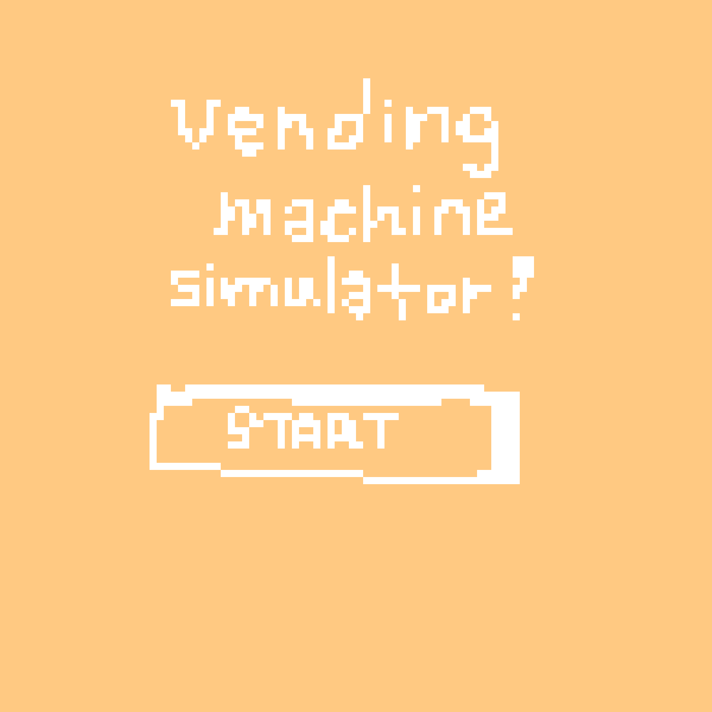
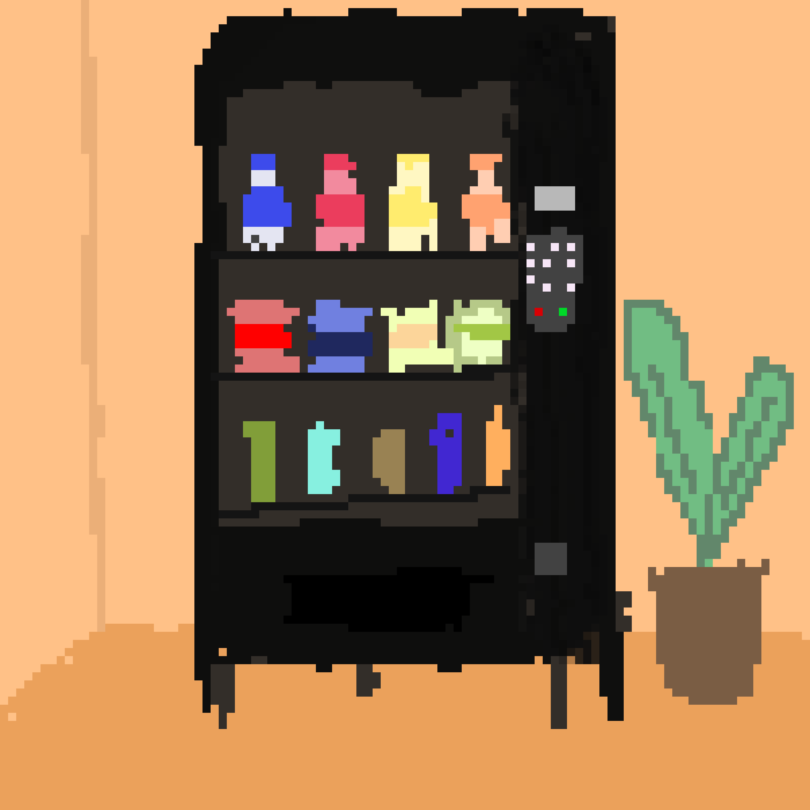
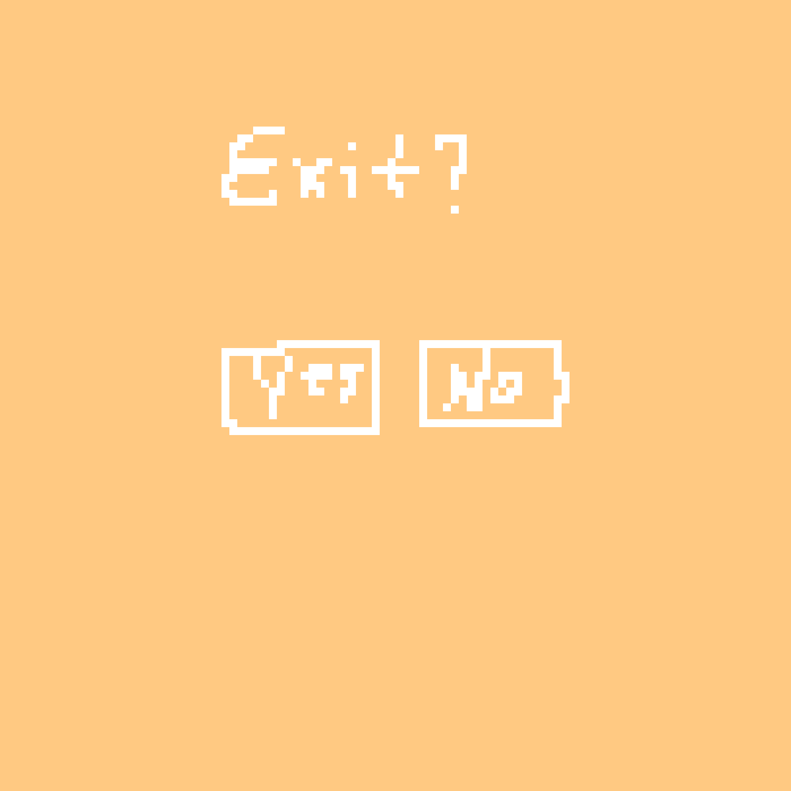
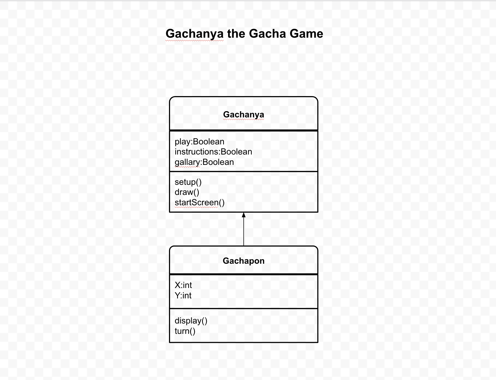

# Programming Project #1: Vending Machine 
(Now renamed to Gachnya, the Gacha game)
Graphic based simulation in which you purchase something from a Gacha Machine

## GUI Image #1: start screen

## GUI Image #2: gameplay

## GUI Image #3: game over screem

## Class Diagram

